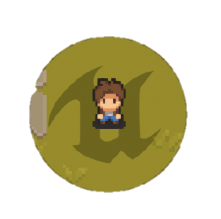
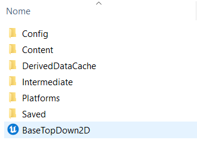

<h1 align="center">
   
   Top Down 2D 
</h1>

<h4 align="center">Simple project template developed in Unreal Engine using PaperZD and Blueprints.</h4>

  <a href="#technologies">Technologies</a> •
  <a href="https://github.com/HenriqueCacerez/template-topdown-2D-UE5/archive/refs/heads/main.zip">Download</a> •
  <a href="#credits">Credits</a> 

***

## Demonstration:

https://github.com/HenriqueCacerez/template-topdown-2D-UE5/assets/110671999/30c4b607-ce43-4d81-a2ef-b04ed48b4066

> **Notice**: This project is not finished. I plan to add new features soon.

***

## Technologies:

- [Paper2D](https://docs.unrealengine.com/5.2/en-US/paper-2d-in-unreal-engine)
- [PaperZD](https://www.unrealengine.com/marketplace/en-US/product/paperzd)
- 100% [Blueprints](https://docs.unrealengine.com/5.2/en-US/introduction-to-blueprints-visual-scripting-in-unreal-engine)
- Unreal Engine [5.2](https://www.unrealengine.com/en-US/blog/unreal-engine-5-2-is-now-available)

***

## Download:

Download this project and open it by clicking on the "**BaseTopDown2D.uproject**" file.

***

## Credits:

<table>
  <tr>
    <td align="center">
      <a href="https://cainos.itch.io">
         
        
          <b>Cainos</b> 
      </a>
          <b>Assets</b>
        
    </td>
    <td align="center">
      <a href="https://game-endeavor.itch.io">
         
        
          <b>Game Endeavor</b> 
      </a>
          <b>Assets</b>
        
    </td>
  </tr>
</table>
